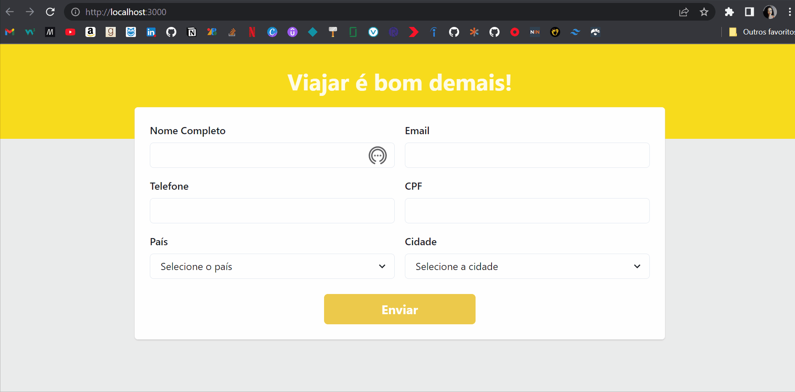

# Teste técnico Ally Hub

O objetivo do teste era criar um formulário onde o usuário informasse seus dados e o destino de interesse, todos os campos deveriam estar preenchidos caso contrário uma mensagem de erro deveria ser exibida na tela abaixo do dado faltante. Outro ponto é que deveria ser usado dois endpoints para popular o campo select de cidade e país escolhido.
Para requisição da API fornecida optei pelo uso do Axios por ser aderente a navegadores antigos e usei a opçao 'all' dele para fazer a requisição dos dois endpoints fornecidos.
Usei a biblioteca Chakra para criar components do formulário, as biblioteca formik e yup para fornecer as mensagens de erro e fazer a validação dos campos.

# Como usar:

 * git clone https://github.com/Keitey/teste-ally.git
 * cd  teste-ally
 * npm install
 * npm start

 # Veja o projeto completo:
https://teste-ally.netlify.app/

# Feito Com:
 
 

Copyright © 2022 Keitey Lopes Barros

 
